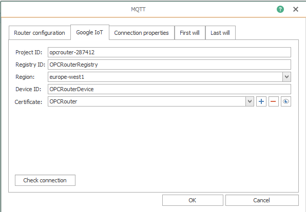
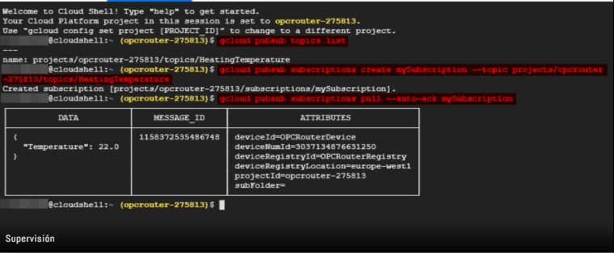

# Trabajo_de_investigacion_3

# TEMA: Desarrollo de ejemplos con Google Cloud IoT

Integrantes: Javier Arteaga, Bryan Azuero, Jhonatan Tituaña

### 1. PLANTEAMIENTO DEL PROBLEMA.

El internet de las cosas IoT es utilizar tecnologías inteligentes para conectar objetos en cualquier lugar a cualquier hora. El internet de las cosas se ha convertido en una tendencia emergente para los investigadores en la academia y la industria, debido a las múltiples posibilidades de desarrollo que este genera. El desarrollo de aplicaciones para IoT debe ser compatibles, con los dispositivos y las nuevas tecnologías en desarrollo o despliegue, debido a que la idea fundamental de IoT es interconectar diferentes dispositivos. El uso de la información en la nube impulsa la innovación, permitiendo experimentar sin riesgos con nuevos modelos de negocio, mejora y actualizaciones de productos, servicios en tiempo real y haciendo frente al principal reto de IoT que es el manejo de una gran cantidad de información por esta razón es que se tendrá la nube como opción óptima de infraestructura para la implementación de un servicio IoT. En la actualidad el Internet de las enfrenta un crecimiento de forma muy acelerada de esta tecnología en diversas áreas así mismo, la demanda del uso de computación en la nube (Cloud Computing) como el recurso virtual más viable para ofertar con mayor eficiencia los servicios expuestos por IoT, esta investigación permite evidenciar que estas dos tecnologías están fuertemente ligadas. 

### 2. OBJETIVOS.

#### Objetivos General

Realizar un análisis de la plataforma de Google Cloud IoT y desarrollar varios ejemplos que ayuden a la mejor compresión del tema.

#### Objetivos Específicos 

Implementar una aplicación de IoT con el fin de usar la infraestructura de Google Cloud ofrecida para dar soporte a los servicios del internet de las cosas.

Identificar los servicios principales de Google Cloud Iot.

Conocer las ventajas y desventajas de Google Cloud IoT.

### 3. ESTADO DEL ARTE

### IoT

En el año 2005 la Unión Internacional de Telecomunicaciones (ITU) nombra por primera vez el término de Internet de las Cosas (IoT por sus siglas en inglés, Internet of Things). Entonces se definió como la conexión en tiempo real de los objetos interconectados en una red permitiendo ser consultados por cualquier otro objeto que se encuentre en esta misma red. En el artículo titulado “PANORAMA DE APLICACIÓN DE INTERNET DE LAS COSAS (IoT)” elaborado por DAVID LEONARDO PINZÓN NIÑO en el año 2015 nos comenta que es necesario aprovechar de una manera óptima la nueva tendencia del internet de las cosas, para encontrar fortalezas que busquen conocer los requisitos de una automatización del entorno, garantizando una mejora en la calidad de vida frente a un mundo tecnológico que ya empieza de manera exponencial a difundirse a nivel mundial. El Internet de las cosas (IoT) se puede definir como una red altamente interconectada de entidades heterogéneas, tales como, etiquetas, sensores, dispositivos embebidos, dispositivos portátiles, etc., que interactúan y se comunican entre sí en tiempo real. IoT revolucionará la manera en que las personas y las organizaciones interactúan con el mundo físico, la interacción con dispositivos domésticos, automóviles, plantas industriales, etc., sufrirá grandes modificaciones. También permitirá que muchos servicios como salud, educación y gestión de recursos, puedan ser mejorados para comodidad del cliente. El uso de nuevas tecnologías facilita los procesos de comunicación dentro de la sociedad, por lo cual se resalta la importancia de estudiar, analizar y plantear posibles oportunidades de desarrollo que generen nuevas ideas para cambiar de mejor manera el mundo en general.

### Google Cloud Plataform.

Sus inicios se remontan a abril de 2008, cuando por primera vez apareció Google App Engine. Finalmente, ha sido lanzada en marzo de 2014 con un gran elenco de servicios a disposición del usuario, además de ser una de más económicas, la decisión en este momento llega a ser puramente económica o bien por facilidad y agilidad de desarrollo. Es una plataforma que ha reunido todas las aplicaciones de desarrollo web que Google estaba ofreciendo por 25 separado; Google Cloud es utilizada para crear ciertos tipos de soluciones a través de la tecnología almacenada en la nube y permite, por ejemplo, destacar la rapidez y la escalabilidad de su infraestructura en las aplicaciones del buscador. Existen varios artículos que proponen la integración de tecnologías Google Cloud como (Ara,Gajkumar & Prabhakar, 2017) que proponen un caso de estudio sobre la integración de sensores con servicios desplegados en plataformas. Sin embargo, a pesar de que implementan un caso de estudio, no brindan detalles de dicha implementación ni proponen mecanismos que faciliten la integración entre servicios dispositivos IoT, proponen una arquitectura de aplicaciones que facilita la interacción entre dispositivos IoT y servicios de procesamiento en entornos cloud. A pesar de usar protocolos y estándares para la comunicación entre servicios, no brindan mecanismos que guíen las actividades de integración e interacción entre servicios de dispositivos IoT. Google Cloud Platform tiene una serie de servicios de la nube, para crear sitios web sencillos o aplicaciones complejas. Se puede dividir en tres grandes grupos: aplicaciones móviles, soluciones para juegos y Compute Engine.

### 4. MARCO TEÓRICO

### Google Cloud IoT.

La plataforma Google Cloud IoT ofrece un conjunto completo de herramientas para conectar, procesar, almacenar y analizar datos tanto en el perímetro como en la nube.
La plataforma se compone de servicios en la nube escalables y totalmente administrados, una pila de software integrada con funciones de aprendizaje automático y el sistema operativo desarrollado para el Internet de las cosas, está diseñado con el fin de ayudar a conectar y gestionar de forma segura dispositivos a gran escala. Es decir, es un sistema de registro y análisis de datos IoT con puente de protocolo que conecta todos los dispositivos con la plataforma basada en la nube.
Cloud IoT Core es un servicio completamente administrado que le permite conectar, administrar e ingerir datos de manera fácil y segura desde millones de dispositivos dispersos por todo el mundo. Cloud IoT Core, en combinación con otros servicios en la plataforma Google Cloud, proporciona una solución completa para recopilar, procesar, analizar y visualizar datos de IoT en tiempo real para respaldar una mayor eficiencia operativa.	

### Características principales

### Sencillez
Google pretende hacer más sencillo el uso de los dispositivos IoT y el tratamiento de los datos que éstos recogen proporcionando la infraestructura y los servicios que el usuario necesite para administrar esos datos, utilizando los servicios de software de Google.

### Acelera la agilidad.

Consigue información útil en tiempo real para tu negocio sobre dispositivos repartidos por todo el mundo, ya estén en el perímetro o en la nube, gracias a los completos servicios de Google Cloud IoT. Cloud IoT Core recopila datos de los dispositivos, que más tarde se publican en Cloud Pub/Sub para las analíticas del downstream.

### Seguridad completa
Utiliza un sistema de seguridad integral gracias a la autenticación mediante claves asimétricas con TLS 1.2 y a los certificados firmados por una autoridad de certificación, que se pueden utilizar para verificar la propiedad de los dispositivos. Los dispositivos que cumplan los requisitos de Cloud IoT Core son capaces de proteger toda la pila.

### Mejora la eficiencia operativa.

Averigua con cuánta eficiencia funcionan los dispositivos, gestiona los recursos mundiales y actualiza el firmware en la plataforma Google Cloud IoT. Esta plataforma admite una amplia gama de sistemas operativos integrados y funciona a la perfección con el sistema operativo Debian Linux. También puedes activar cambios automáticos en función de eventos en tiempo real por medio de los flujos de trabajo de Cloud Functions.

### Administrador de dispositivos.

Puedes configurar y gestionar de forma segura dispositivos concretos de manera general. Esa tarea se puede hacer mediante una consola o de forma programática. Este administrador establece la identidad de un dispositivo y proporciona el mecanismo de autenticación al conectarlo. Además, mantiene una configuración lógica de todos los dispositivos y se puede usar para controlarlos de forma remota desde la nube.
### Puente de protocolos.

El puente de protocolos proporciona puntos de conexión para los protocolos con balanceo de carga automático de cara a la conexión de todos los dispositivos. Este puente ofrece compatibilidad nativa para la conexión segura mediante protocolos estándar del sector, como MQTT y HTTP. También publica la telemetría de todos los dispositivos en Cloud Pub/Sub, que pueden consumir los sistemas de análisis posteriores.

### Ámbitos de aplicación.

• Mantenimiento predictivo: Consiste en la predicción de forma automatizada de cuándo se debe realizar el mantenimiento, optimización de su rendimiento en tiempo real, anticipación de los periodos inactivos, detección de anomalías y monitorización del estado y la ubicación de los dispositivos.

• Monitorización de recursos en tiempo real: La plataforma permite monitorizar los recursos valiosos en tiempo real, ejecutar análisis complejos y procesos de aprendizaje automático en los datos recopilados y mostrar el estado de una empresa para aportar métricas útiles.

### 5. DIAGRAMAS.

### 6. MAPA DE VARIABLES

### 7. EXPLICACIÓN DEL CÓDIGO FUENTE

### Envió de datos por Protocolo MQTT.

Como primer paso debemos crear un proyecto en Google Cloud Plataform y configurar como lo deseemos, debemos tener muy encuenta el nombre del registro que coloquemos, el servidor, el id del proyecto, asi tambien del id del dispositivo que agregemos ya que estos datos nos serviran mas adelante.

Una vez ya configurada nuestro proyecto con su respectivo registro que nos incluye los protocolos de comunicacion,entramos al apartado de dispositivos y lo dejamos pendiente.

### OPC Router

Ingresamos a OPC Router y creamos un complemento de MQTT en la parte de plug-ins,  en este apartado configuraremos la parte del enrutado, colocando el nombre y el perfil de la nube en este caso Google IoT,El perfil de la nube noa facilitara la introducción de los datos de conexión específicos de Google para la conexión MQTT.
Después de eso, hacemos clic en la pestaña "Google IoT" para  crear un certificado, luego a detalles y copiamos nuestro archivo y lo configuramos segun nuestro necesidad.

Regresamos a la platafirma de Google en la parte de "CREAR UN DISPOSITIVO" y introducimos el ID de dispositivo que nos declaramos en el paso anterior. Utilizaremos el formato "RS256_X509 y expotaremos el certificado creado por OPC Router.

Regresamos a la parte de OPC Router en la pestaña de Google IoT e ingresamos los datos ID de proyecto,ID de registro,Región,ID de dispositivo que fueron proporcinados despues de la creacion de dispositivo en la seccion anterior.

Establecemos la conexion y hacemos click en el boton check conecction si todo esta bien no saltara el mensaje de conexion establecida.

Conexión en OPC Router que simula el valor de temperatura de un sensor.

Cuando tengamos la conexión ya establecida procederemos a elaborar nuestro proyecto en la aplicación de OPC Router, estableciendo el tipo de dato que enviaremos y nuestro protocolo de comunicación.Esta parte la realizaremos en conexiones.
Una vez ya establecido nuestro flujo arrastraremos varios componetentes que estan disponibles como Json Write que es el formato que se enviara a la nube, MQTT sera el protocolo de comunicacion entre OPC Router y Google Cloud, en esta seccion colocaremos el nombre de nuestro proyecto, el certificado , y el servidor, el tipo de dato que se enviara y la ruta del topic.las otras variables son del tiempo de ejecucion y una constante que este vinculada al database.

Guardaremos y exportaremos.

Para verificar si que la conexión se estableció nos dirigiremos a la plataforma Google Cloud, en el apartado de dispositivos nos aparecerá la "comunicación permitida", si es así la conexión fue un éxito, esta de color verde.

Como paso final abrimos la consola o shell que se encuentra en la parte superior derecha y procederemos a escribir los siguientes comandos.
Comando para visualizar la lista disponible “gcloud pubsub topics list”:
Comando para suscribirse al tema “gcloud pubsub subscriptions create mySubscription –topic projects/opc-router-project/topics/
Leer el último registro de datos transferido: gcloud pubsub subscriptions pull –auto-ack
y nos debe arrojar el siguiente resultado.

### 8. CONCLUSIONES

### 9. RECOMENDACIONES

### 10. CRONOGRAMA

### 11. BIBLIOGRAFÍA

### 12. ANEXOS
